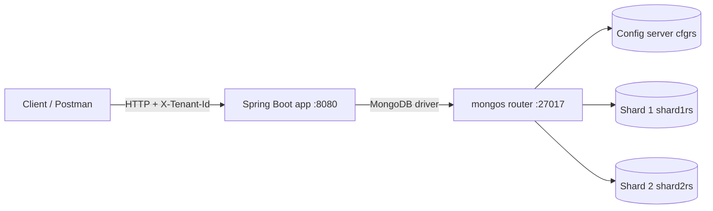
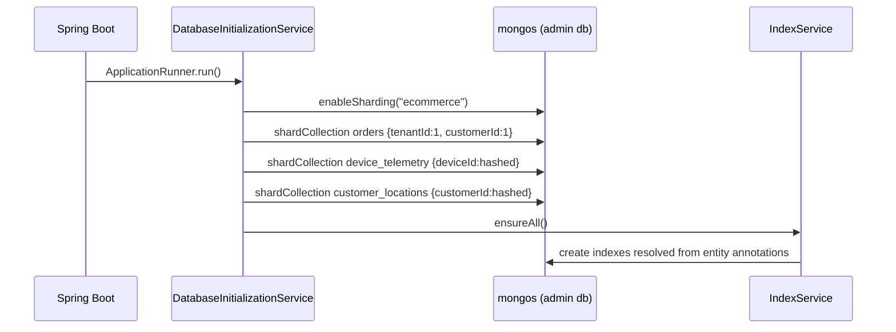
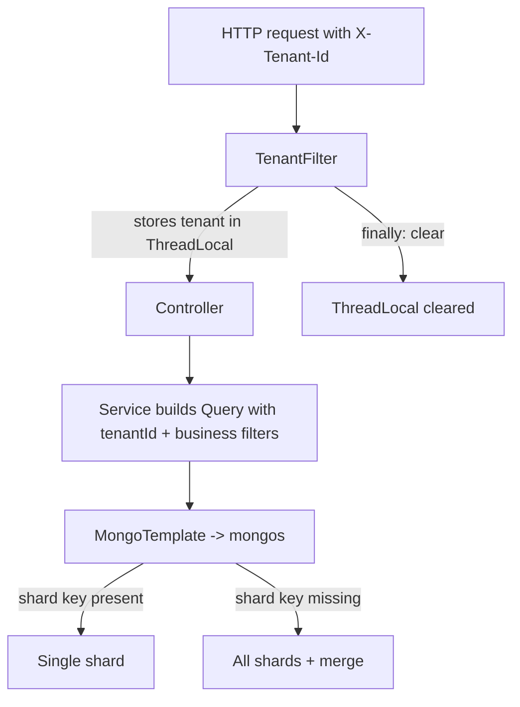

# E-Commerce NoSQL Indexing & Sharding Lab

Spring Boot 3 + Spring Data MongoDB project that demonstrates, hands-on, every core NoSQL indexing type, compound shard keys, hashed vs range sharding, tenant-based application partitioning, and query-plan profiling (`explain("executionStats")`) on a **real sharded MongoDB cluster** (1 mongos, 1 config server, 2 shards).

Domain: a high-volume e-commerce **order and delivery tracking** platform.

---

## Table of contents

1. [Tech stack](#1-tech-stack)
2. [Architecture](#2-architecture)
3. [Project structure](#3-project-structure)
4. [Getting started](#4-getting-started)
5. [End-to-end workflow](#5-end-to-end-workflow)
6. [Class-by-class reference](#6-class-by-class-reference)
7. [Indexing guide: what, where, how, why, benefit](#7-indexing-guide)
8. [Sharding and partitioning guide](#8-sharding-and-partitioning-guide)
9. [Reading explain output](#9-reading-explain-output)
10. [REST API reference](#10-rest-api-reference)
11. [Testing](#11-testing)
12. [Known limitations and design trade-offs](#12-known-limitations-and-design-trade-offs)
13. [Interview cheat sheet](#13-interview-cheat-sheet)
14. [Troubleshooting](#14-troubleshooting)

---

## 1. Tech stack

| Layer | Technology |
|---|---|
| Language / runtime | Java 17 |
| Framework | Spring Boot 3.3.x, Spring Web, Spring Data MongoDB |
| Database | MongoDB 7.0 sharded cluster (Docker Compose) |
| Boilerplate reduction | Lombok (`@Getter`, `@Setter`, `@Builder`, `@RequiredArgsConstructor`) |
| Tests | JUnit 5, Testcontainers (single-node Mongo) |
| API testing | Postman collection in `/postman` |

---

## 2. Architecture



* The application talks **only to mongos**. mongos reads chunk metadata from the config server and routes each operation:
  * **Targeted**: filter contains the shard key (or a prefix of it) -> one shard.
  * **Scatter-gather**: filter has no shard-key prefix -> all shards, results merged by mongos.
* Each shard is a one-member replica set (enough for a lab; production uses 3 members).

### Collections and how each is distributed

| Collection | Entity | Shard key | Type | Reason |
|---|---|---|---|---|
| `orders` | `Order` | `{tenantId:1, customerId:1}` | Range, compound | Tenant-scoped queries are targeted; `customerId` adds cardinality |
| `device_telemetry` | `DeviceTelemetry` | `{deviceId:"hashed"}` | Hashed | Very write-heavy; spreads inserts evenly |
| `customer_locations` | `CustomerLocation` | `{customerId:"hashed"}` | Hashed | Uniform spread; geo queries scatter-gather anyway |

---

## 3. Project structure

```
ecommerce-nosql-lab
├── docker-compose.yml              # sharded cluster definition
├── docker/init-cluster.sh          # rs.initiate for 3 replica sets + sh.addShard
├── postman/                        # Postman collection (33 requests, with assertions)
├── pom.xml
└── src
    ├── main
    │   ├── resources/application.yml
    │   └── java/com/publicis/nosql
    │       ├── EcommerceNoSqlLabApplication.java
    │       ├── domain/     Order, DeviceTelemetry, CustomerLocation
    │       ├── dto/        ExplainMetrics, ExplainComparison, BenchmarkResult
    │       ├── service/    IndexService, DatabaseInitializationService, OrderService,
    │       │               TelemetryService, QueryProfilerService, BenchmarkService
    │       ├── tenant/     TenantContext, TenantFilter, TenantPartitionService
    │       └── web/        OrderController, TelemetryController, PerformanceController, TenantController
    └── test/java/com/publicis/nosql/IndexingIT.java
```

---

## 4. Getting started

**Prerequisites:** JDK 17+, Maven 3.9+, Docker Desktop.

```bash
# 1. Start the sharded cluster (wait ~30 s for the cluster-init container to finish)
docker compose up -d

# 2. Run the application (connects to mongos on localhost:27017)
mvn spring-boot:run

# 3. (Optional) run the Testcontainers indexing test; Docker must be running
mvn verify
```

Verify the cluster:

```bash
docker compose exec mongos mongosh --eval "sh.status()"
```

You should see two shards (`shard1rs`, `shard2rs`) and, after the app starts, `ecommerce.orders`, `ecommerce.device_telemetry` and `ecommerce.customer_locations` listed as sharded.

Import `postman/*.json` into Postman and run the folders in order (Benchmark, Profiler, Orders, Telemetry, Tenants).

### Configuration (`application.yml`)

| Property | Value | Meaning |
|---|---|---|
| `spring.data.mongodb.uri` | `mongodb://localhost:27017/ecommerce` | Points at **mongos** |
| `spring.data.mongodb.auto-index-creation` | `false` | Indexes are created explicitly by `IndexService` (see why in section 5) |
| `app.sharding.enabled` | `true` | Set `false` for single-node Mongo (used by the Testcontainers test) |

---

## 5. End-to-end workflow

### 5.1 Startup workflow



Why this order and why `auto-index-creation=false`:

1. `shardCollection` is cheapest on an **empty** collection, and MongoDB automatically creates the index that supports the shard key.
2. If Spring created annotation indexes first (at first repository use), a unique index that does not start with the shard key would make `shardCollection` **fail**.
3. Explicit index control also lets the benchmark **drop and recreate** indexes to show BEFORE/AFTER performance.

### 5.2 Request workflow (multi-tenant)



### 5.3 Benchmark workflow (BEFORE / AFTER)

```
POST /benchmark/indexes/drop     -> remove secondary indexes
POST /benchmark/seed?count=...   -> bulk load (faster without indexes)
GET  /benchmark/run              -> plan is COLLSCAN, high latency
POST /benchmark/indexes/create   -> build indexes from annotations
GET  /benchmark/run              -> plan is IXSCAN (esr_status_customer_date), low latency
POST /benchmark/compare          -> all of the above in one call, returns speedup
```

---

## 6. Class-by-class reference

### 6.1 Entry point

**`EcommerceNoSqlLabApplication`** is the standard `@SpringBootApplication` bootstrap. Nothing custom; all behaviour comes from the beans below.

### 6.2 Domain package (`domain`)

**`Order`** is the core entity, mapped to `orders`, sharded by `{tenantId, customerId}`. It carries almost every index type in the project.

| Field | Purpose | Index / role |
|---|---|---|
| `id` | MongoDB `_id` | Automatic `_id_` index |
| `tenantId` | Tenant owner | Shard-key part 1 |
| `customerId` | Customer | Shard-key part 2, equality field in ESR index |
| `orderNumber` | Business order number | Part of the unique compound index |
| `status` | NEW, PAID, SHIPPED, DELIVERED, CANCELLED | Equality field in ESR index; partial-index filter |
| `totalAmount` | Order value | Partial index key and filter |
| `orderDate` | Order timestamp | Sort/range field in ESR index |
| `couponCode` | Optional coupon | `@Indexed(sparse = true)` |
| `notes`, `tags` | Free text | `@TextIndexed` (weights 3 and 1) |

Class-level annotations: `@Document("orders")`, `@Sharded(shardKey = {"tenantId","customerId"})` and `@CompoundIndexes` with three named indexes. Index names are constants (`IDX_UNIQUE`, `IDX_ESR`, `IDX_PARTIAL`) so services can reference them in `hint()` calls.

**`DeviceTelemetry`** stores IoT/tracking events (temperature, battery) for deliveries. `recordedAt` carries the **TTL index**, and a compound index `device_time {deviceId:1, recordedAt:-1}` serves "latest readings for a device". Sharded hashed on `deviceId`.

**`CustomerLocation`** stores a customer's `GeoJsonPoint location` with a **2dsphere** index for proximity queries.

### 6.3 DTO package (`dto`)

Java records returned by the profiling and benchmark endpoints:

* **`ExplainMetrics`**: `label`, `topStage`, `leafStage` (IXSCAN/COLLSCAN), `indexName`, `shardsTargeted`, `totalKeysExamined`, `totalDocsExamined`, `nReturned`, `executionTimeMillis`.
* **`ExplainComparison`**: the same query explained three ways (forced collection scan, forced index, planner's choice) plus a `docsExaminedReduction` summary string.
* **`BenchmarkResult`**: label, iteration count, average and minimum latency, returned rows and the `ExplainMetrics` of the plan used.

### 6.4 Service package (`service`)

**`DatabaseInitializationService`** (`ApplicationRunner`). Runs once at startup. Issues the admin commands `enableSharding` and `shardCollection` through `MongoTemplate` against the `admin` database, then calls `IndexService.ensureAll()`. Commands are idempotent and failures are logged rather than fatal, so restarts are safe. Hashed collections get `numInitialChunks: 4` so both shards receive writes immediately instead of waiting for the balancer.

**`IndexService`**. Uses Spring's `MongoPersistentEntityIndexResolver` to read the index annotations of an entity and creates them with `IndexOperations.ensureIndex`.
* `ensureAll()` / `ensure(Class)`: create indexes for all entities / one entity.
* `dropSecondary(Class)`: drops every index except `_id_`; indexes MongoDB refuses to drop (shard-key support) are skipped with a warning.
* `describe(Class)`: returns name, keys, unique, sparse, partial filter and TTL seconds for each index (used by `/performance/indexes` and `/telemetry/ttl-info`).

**`OrderService`**. CRUD and searches on `Order`:
* `create`: inserts, stamping `tenantId` and default `orderDate`.
* `get`: by `_id` + `tenantId`, optionally `customerId`. With `customerId` the query contains the **full shard key** (targeted); without it, scatter-gather.
* `update`: `save()` on a `@Sharded` entity; Spring Data adds the shard key to the update filter.
* `delete`: requires `customerId` so the delete is targeted.
* `search`: ESR-shaped query (`tenantId`, `status`, `customerId`, optional `orderDate` range, sort by `orderDate` desc). `useHint=true` applies `query.withHint("esr_status_customer_date")`.
* `textSearch`: `TextQuery` with `matchingAny(terms)` sorted by relevance score.
* `highValueDelivered`: `status = DELIVERED and totalAmount > minAmount`, the query shape that can use the partial index.

**`TelemetryService`**. Telemetry insert (sets `recordedAt = now` so the TTL clock starts), latest-by-device query, TTL index description, location insert, and the two geo queries: `near` (`$near`, nearest first, distance in meters) and `within` (`$geoWithin` with a spherical circle, unordered).

**`QueryProfilerService`**. The interview centrepiece. For a query shape it runs `explain(EXECUTION_STATS)` three times: with `hint({$natural:1})` (forces a collection scan), with the named index hint, and with no hint (planner's choice). It parses the result into `ExplainMetrics`. Because a sharded explain nests plans under `shards[].winningPlan`, a recursive `findLeaf` walks the tree to locate the real `IXSCAN`/`COLLSCAN` stage and its `indexName`. `topStage` reveals routing: `SINGLE_SHARD` (targeted) vs `SHARD_MERGE` (scatter-gather).

**`BenchmarkService`**.
* `seed(count)`: generates synthetic orders (3 tenants, 5,000 customers, 5 statuses, random amounts and dates within a year, ~10% with coupons, random notes/tags) and inserts in batches of 5,000.
* `run(...)`: executes the ESR query N times and reports average/min latency plus the plan.
* `compare(...)`: drop indexes, run, recreate indexes, run, and return the speedup factor.

### 6.5 Tenant package (`tenant`)

**`TenantContext`**. A `ThreadLocal` holder for the current tenant id (defaults to `tenantA`).

**`TenantFilter`**. A `OncePerRequestFilter` that reads `X-Tenant-Id`, stores it in `TenantContext`, and **always clears it in `finally`** so pooled threads never leak tenant identity.

**`TenantPartitionService`**. Application-level partitioning. Keeps one shared `MongoClient` (single connection pool) and a cache of lightweight `MongoTemplate` objects, one per tenant database (`ecommerce_<tenant>`).
* `saveInTenantDatabase` / `listFromTenantDatabase`: **database-per-tenant**.
* `saveInTenantCollection`: **collection-per-tenant** (`orders_<tenant>`).
* Tenant ids are whitelisted with `[A-Za-z0-9_-]{1,40}` because they become database/collection names (blocks injection such as `../admin`).

### 6.6 Web package (`web`)

| Controller | Base path | Responsibility |
|---|---|---|
| `OrderController` | `/api/v1/orders` | CRUD, index-hinted search, text search, high-value search |
| `TelemetryController` | `/api/v1/telemetry` | Telemetry, TTL info, locations, `near` and `within` |
| `PerformanceController` | `/api/v1/performance`, `/api/v1/benchmark` | `explain`, index listing, shard distribution, seed and benchmark |
| `TenantController` | `/api/v1/tenants` | Database-per-tenant and collection-per-tenant demos |

---

## 7. Indexing guide

### 7.1 Summary: every index in the project

| # | Index type | Where (class.field) | Index name | Serves |
|---|---|---|---|---|
| 1 | Default `_id` | every entity | `_id_` | Lookups by id |
| 2 | Compound + **Unique** | `Order` (class-level) | `uq_tenant_customer_orderNumber` | Duplicate-order prevention, order lookup by number |
| 3 | Compound, **ESR** | `Order` (class-level) | `esr_status_customer_date` | `find({status, customerId}).sort({orderDate:-1})` |
| 4 | **Partial** | `Order` (class-level) | `partial_delivered_high_value` | Delivered orders above 500 |
| 5 | **Sparse** single-field | `Order.couponCode` | `couponCode` | Coupon lookups |
| 6 | **Text**, multi-field, weighted | `Order.notes`, `Order.tags` | text index | Full-text search |
| 7 | **TTL** | `DeviceTelemetry.recordedAt` | `ttl_recordedAt` | Auto-deleting old telemetry |
| 8 | Compound | `DeviceTelemetry` (class-level) | `device_time` | Latest readings per device |
| 9 | **2dsphere** (geospatial) | `CustomerLocation.location` | `geo_location` | `$near`, `$geoWithin` |
| 10 | **Hashed** (shard-key index) | `device_telemetry.deviceId`, `customer_locations.customerId` | auto-created | Even data distribution |
| 11 | Range shard-key index | `orders {tenantId, customerId}` | auto-created | Chunk routing |

### 7.2 Details, one index at a time

#### A. Unique compound index (`Order`, `uq_tenant_customer_orderNumber`)

```java
@CompoundIndex(name = Order.IDX_UNIQUE,
               def = "{'tenantId':1,'customerId':1,'orderNumber':1}", unique = true)
```

* **How:** the index rejects a second order with the same triple.
* **Why compound instead of `@Indexed(unique = true)` on `orderNumber`:** on a sharded collection MongoDB can only enforce uniqueness for indexes that **start with the shard key**. A plain unique index on `orderNumber` would make `shardCollection` fail, because each shard could only check its own data. Prefixing it with `{tenantId, customerId}` guarantees a given order number always lives on one shard, so the check is local.
* **Benefit:** integrity is enforced by the database (safe under concurrency), and the same index accelerates order lookups by number within a customer. For cluster-wide unique numbers, generate them (UUID/Snowflake) or keep a separate lookup collection.

#### B. Compound ESR index (`Order`, `esr_status_customer_date`)

```java
@CompoundIndex(name = Order.IDX_ESR, def = "{'status':1,'customerId':1,'orderDate':-1}")
```

* **ESR rule:** put **E**quality fields first, then the **S**ort field, then **R**ange fields. Here `status` and `customerId` are equality, `orderDate` is both the sort and the range field.
* **Used by:** `OrderService.search` and the benchmark query: `find({status:'DELIVERED', customerId:'CUST-42'}).sort({orderDate:-1})`.
* **Why:** the index walks straight to the matching `(status, customerId)` block whose entries are already stored newest-first, so MongoDB returns the top N without a `SORT` stage (no in-memory sort) and examines almost only the documents it returns.
* **Prefix rule:** it also serves queries on `{status}` and `{status, customerId}`, but **not** `{customerId}` alone or `{orderDate}` alone. Field order in the *index* is what matters; the order in the *query document* does not.
* **Benefit:** the benchmark shows `totalDocsExamined` falling from about 100,000 (collection scan) to roughly the number of returned documents, and latency dropping by one to two orders of magnitude.

#### C. Partial index (`Order`, `partial_delivered_high_value`)

```java
@CompoundIndex(name = Order.IDX_PARTIAL, def = "{'totalAmount':1}",
    partialFilter = "{'status':'DELIVERED','totalAmount':{'$gt':500}}")
```

* **How:** only documents matching the filter are indexed (roughly 15-20% of the seeded data).
* **Used by:** `OrderService.highValueDelivered` (`status = DELIVERED and totalAmount > minAmount`).
* **Rule:** the planner picks it only when the query predicate is guaranteed to be a **subset** of the filter. `minAmount >= 500` qualifies; `minAmount = 100` does not, and falls back to another plan. Try both in `/performance/explain?scenario=partial`.
* **Benefit:** a much smaller index (less RAM, faster scans) and cheaper writes, because inserts and updates of non-matching orders skip index maintenance. Ideal for hot subsets such as "high-value delivered orders for finance reports".

#### D. Sparse index (`Order.couponCode`)

```java
@Indexed(sparse = true) private String couponCode;
```

* **How:** documents **without** the field are not indexed. About 90% of seeded orders have no coupon.
* **Why:** an optional field would otherwise fill the index with null entries.
* **Benefit:** a small index and fast "orders using coupon X" queries. Note the difference from partial: sparse only decides by *field presence*; partial can use any expression. MongoDB recommends partial indexes as the more general tool; sparse is shown here for completeness.

#### E. Text index (`Order.notes`, `Order.tags`)

```java
@TextIndexed(weight = 3) private String notes;
@TextIndexed private List<String> tags;
```

* **How:** MongoDB tokenises, lowercases and stems both fields into one text index. `notes` matches count three times more than `tags` in the relevance score.
* **Used by:** `OrderService.textSearch` (`TextQuery ... sortByScore()`), for example `?q=fragile gift`.
* **Constraint:** only **one** text index is allowed per collection, which is why both fields share one definition.
* **Benefit:** ranked keyword search across free text without regex scans (`$regex` on unindexed text is a full collection scan). For advanced relevance (fuzzy, facets) use Atlas Search or Elasticsearch.

#### F. TTL index (`DeviceTelemetry.recordedAt`)

```java
@Indexed(name = "ttl_recordedAt", expireAfterSeconds = 3600)
private Instant recordedAt;
```

* **How:** a background thread checks about every 60 seconds and deletes documents whose `recordedAt` is older than one hour. The field must be a BSON date (Spring maps `Instant` correctly).
* **Why:** telemetry is high-volume and only recent readings matter.
* **Benefit:** automatic retention with no cron job, no delete-by-query load spikes written in application code, and bounded storage. Deletion is not instant (about 60 s granularity). Verify with `GET /api/v1/telemetry/ttl-info`.

#### G. Compound index on telemetry (`device_time`)

`{deviceId:1, recordedAt:-1}` follows the same ESR logic: equality on the device, sort newest first. It serves `TelemetryService.latest`.

#### H. Geospatial 2dsphere index (`CustomerLocation.location`)

```java
@GeoSpatialIndexed(type = GeoSpatialIndexType.GEO_2DSPHERE, name = "geo_location")
private GeoJsonPoint location;
```

* **How:** indexes GeoJSON points on a spherical earth model. Coordinates are `[longitude, latitude]`.
* **Used by:**
  * `near(lon, lat, maxKm)`: `$near`, returns results **sorted by distance**, `maxDistance` in meters.
  * `within(lon, lat, radiusKm)`: `$geoWithin` with `$centerSphere`, membership test with **no ordering**, so it is cheaper.
* **Benefit:** proximity queries ("customers within 5 km of a warehouse") run against the index instead of computing haversine distance for every document.

#### I. Hashed shard keys (`device_telemetry`, `customer_locations`)

* **How:** MongoDB hashes the key value and shards on the hash.
* **Why:** telemetry is write-heavy, and even with non-monotonic ids a hashed key gives near-perfect distribution and avoids hot shards.
* **Trade-off:** range queries on the key become scatter-gather (adjacent values land on different shards); equality queries stay targeted.

#### J. Range compound shard key (`orders`)

See the sharding section below.

### 7.3 Index design rules demonstrated

1. **Order fields E-S-R** (equality, sort, range).
2. **Prefix rule**: an index on `(a, b, c)` serves `a`, `(a,b)` and `(a,b,c)`, not `b` or `c` alone.
3. **Unique indexes on sharded collections must include the shard key as a prefix.**
4. **Indexes cost writes and RAM.** Every insert updates every index; partial and sparse indexes reduce that cost.
5. **Always verify with `explain`.** `hint()` is a diagnostic tool here, not something to hard-code in production without evidence.

---

## 8. Sharding and partitioning guide

### 8.1 Choosing the shard key for `orders`

`{tenantId, customerId}` (range):

| Criterion | How the key satisfies it |
|---|---|
| High cardinality | 5,000 customers per tenant give many distinct values, so chunks can split |
| Even write distribution | Neither field increases monotonically, so no single "hot" shard |
| Query targeting | Almost every query carries the tenant; adding the customer targets one shard |
| Growth | `customerId` prevents a single huge tenant from becoming an unsplittable jumbo chunk |

Rejected alternatives: `orderDate` or `_id` (ObjectId) are monotonic, so all inserts hit the last chunk; `status` has 5 values (low cardinality); `tenantId` alone would create jumbo chunks for big tenants.

### 8.2 Targeted vs scatter-gather

| Query | Shard key in filter? | `topStage` | Shards |
|---|---|---|---|
| `{tenantId, customerId, ...}` | Full key | `SINGLE_SHARD` | 1 |
| `{tenantId, ...}` | Prefix | `SINGLE_SHARD` or few shards | 1 to few |
| `{customerId, ...}` only | No prefix | `SHARD_MERGE` | All |
| `{status: 'X'}` | No | `SHARD_MERGE` | All |

Call `/performance/explain` with and without `tenantId` to see both.

### 8.3 Range vs hashed

| | Range (`orders`) | Hashed (`device_telemetry`) |
|---|---|---|
| Range queries on key | Targeted | Scatter-gather |
| Write distribution | Depends on key quality | Uniform |
| Best for | Query locality, multi-tenant | Insert-heavy, monotonic keys |

### 8.4 Application-level partitioning (`TenantPartitionService`)

| Strategy | Isolation | Overhead | When to use |
|---|---|---|---|
| Shared collection + `tenantId` in shard key (`orders`) | Logical | Low | Many small/medium tenants |
| Collection-per-tenant (`orders_<tenant>`) | Medium | Grows with tenant count (each collection has files and indexes) | Dozens to hundreds of tenants |
| Database-per-tenant (`ecommerce_<tenant>`) | Strong (backup, restore, quota per tenant) | Highest | Few large or regulated tenants |

The shared-collection model is sharded by MongoDB; the other two are partitioned by the application, which routes each request by the `X-Tenant-Id` header.

---

## 9. Reading explain output

`/api/v1/performance/explain` returns:

```json
{
  "queryShape": "...",
  "collectionScan": { "leafStage": "COLLSCAN", "totalDocsExamined": 100000, "nReturned": 40, "executionTimeMillis": 95 },
  "indexScan":      { "leafStage": "IXSCAN", "indexName": "esr_status_customer_date", "totalDocsExamined": 40, "nReturned": 40, "executionTimeMillis": 1 },
  "plannerChoice":  { "topStage": "SINGLE_SHARD", "shardsTargeted": 1 },
  "docsExaminedReduction": "99.9% fewer docs examined (100000 -> 40)"
}
```

(Numbers are illustrative.)

| Field | What to look for |
|---|---|
| `leafStage` | `IXSCAN` good; `COLLSCAN` means the whole collection was read |
| `totalDocsExamined` vs `nReturned` | Ideally close to 1:1. A large gap means the index is not selective |
| `totalKeysExamined` | Index entries scanned; close to `nReturned` for a well-fitted index |
| `indexName` | Which index the winning plan actually used |
| `topStage` / `shardsTargeted` | Routing: `SINGLE_SHARD` targeted, `SHARD_MERGE` scatter-gather |
| `executionTimeMillis` | Server-side time (excludes network and Java mapping) |

---

## 10. REST API reference

Header `X-Tenant-Id` selects the tenant (default `tenantA`).

**Orders** (`/api/v1/orders`)

| Method | Path | Notes |
|---|---|---|
| POST | `/` | Create order |
| GET | `/{id}?customerId=` | With `customerId`: targeted |
| PUT | `/{id}` | Body must include `customerId` |
| DELETE | `/{id}?customerId=` | `customerId` required |
| GET | `/search?status&customerId&from&to&useHint` | ESR index search |
| GET | `/text?q=` | Full-text search |
| GET | `/high-value?minAmount=500` | Partial index |

**Telemetry** (`/api/v1/telemetry`)

| Method | Path | Notes |
|---|---|---|
| POST | `/` | Record reading |
| GET | `/device/{deviceId}?limit=` | Latest readings |
| GET | `/ttl-info` | Shows TTL index |
| POST | `/locations` | Save GeoJSON location |
| GET | `/locations/near?lon&lat&maxKm` | `$near` |
| GET | `/locations/within?lon&lat&radiusKm` | `$geoWithin` |

**Performance and benchmark**

| Method | Path | Notes |
|---|---|---|
| GET | `/api/v1/performance/explain?scenario=esr\|partial&status&customerId&tenantId` | Plan comparison |
| GET | `/api/v1/performance/indexes` | List `Order` indexes |
| GET | `/api/v1/performance/shard-distribution` | Documents per shard |
| POST | `/api/v1/benchmark/seed?count=100000` | Bulk insert |
| POST | `/api/v1/benchmark/indexes/drop` / `create` | Manage secondary indexes |
| GET | `/api/v1/benchmark/run?customerId&iterations` | Timed query |
| POST | `/api/v1/benchmark/compare` | BEFORE vs AFTER |

**Tenants** (`/api/v1/tenants`)

| Method | Path | Notes |
|---|---|---|
| POST | `/orders` | Save to `ecommerce_<tenant>` |
| GET | `/orders?limit=` | List tenant's orders |
| POST | `/orders/collection-per-tenant` | Save to `orders_<tenant>` |

---

## 11. Testing

* **Postman:** import the collection from `/postman`; every request has assertions (for example `COLLSCAN` before indexing, `IXSCAN` after).
* **Integration test:** `IndexingIT` starts a single-node MongoDB with Testcontainers (sharding disabled via `app.sharding.enabled=false`), seeds 5,000 orders, and asserts that the forced collection scan is `COLLSCAN`, the ESR hint is `IXSCAN` using `esr_status_customer_date`, and fewer documents are examined with the index. Testcontainers cannot easily start a full sharded cluster, so sharding behaviour is verified with Docker Compose plus Postman.
* **Inspect directly:**

```bash
docker compose exec mongos mongosh
use ecommerce
db.orders.getIndexes()
db.orders.getShardDistribution()
sh.status()
```

---

## 12. Known limitations and design trade-offs

1. **Unique `orderNumber` is scoped to `(tenantId, customerId)`**, not global (see 7.2 A).
2. **The ESR index does not include `tenantId`.** `OrderService.search` also filters on `tenantId`, which is applied as a residual filter after the index. For production, put `tenantId` first: `(tenantId, status, customerId, orderDate)`; it also matches the shard-key prefix. It is kept as-is here so the ESR example is easy to read.
3. **Partial index applicability is strict.** Queries with `minAmount < 500` cannot use it.
4. **One text index per collection**, and text search relevance is basic.
5. **TTL deletion is approximate** (about 60-second cycle).
6. **`dropSecondary` skips the shard-key index**, which MongoDB will not let you drop.
7. **Balancer timing.** Right after a large seed, most data may sit on one shard until the balancer migrates chunks. Wait and re-check `/shard-distribution`.
8. **Single-member replica sets** are for the lab only; production needs three members per shard and config server.
9. **No authentication or TLS** on the Mongo cluster or the API.

---

## 13. Interview cheat sheet

**How do compound index prefixes work?**
An index on `(a, b, c)` is sorted by `a`, then `b` within each `a`, then `c`. It can serve queries on `a`, `(a,b)`, `(a,b,c)`. A query on `b` alone cannot use it efficiently because `b` values are scattered across every `a`. The order of fields in the query document is irrelevant; the order in the index is what counts. Design with ESR: equality, sort, range.

**How do you choose a shard key?**
High cardinality (many distinct values so chunks can split), high frequency of use in queries (so most queries are targeted), and non-monotonic (so inserts spread across shards). Use a compound key to add cardinality, or a hashed key when the natural key is monotonic. Beware: the shard key is hard to change (resharding is possible in 5.0+ but expensive) and unique indexes must include it.

**Scatter-gather vs targeted queries?**
With the shard key (or a prefix), mongos routes to one shard: latency and load stay flat as the cluster grows. Without it, mongos queries every shard and merges: cost grows with shard count. Detect with `explain()`: `SINGLE_SHARD` vs `SHARD_MERGE`.

**COLLSCAN vs IXSCAN, and what do you check?**
Compare `totalDocsExamined` to `nReturned`, confirm `IXSCAN` and the expected `indexName`, and ensure there is no in-memory `SORT` stage.

**Why hashed vs range shard key?**
Hashed distributes writes evenly but breaks range queries; range keeps locality and supports range queries but needs a well-distributed key.

**Partial vs sparse?**
Sparse: indexes documents that have the field. Partial: indexes documents matching any filter expression. Partial is the more general and generally preferred.

**Why not index everything?**
Each index consumes RAM and slows every write. Index for real query patterns and remove unused ones.

---

## 14. Troubleshooting

| Symptom | Cause / fix |
|---|---|
| `cannot find symbol` for `builder()`, `setX`, `getX` on build | Lombok annotation processing is not running (JDK 23+ disables implicit processors). The `pom.xml` registers Lombok under `maven-compiler-plugin` `annotationProcessorPaths`. In IntelliJ enable **Settings > Build > Compiler > Annotation Processors > Enable** |
| `Connection refused` on 27017 | Cluster not started; run `docker compose up -d` and check `docker compose ps`. mongos restarts until the config server is initiated |
| `shardCollection` warnings at startup | Usually harmless (already sharded). Anything else: check `docker compose logs cluster-init` |
| Everything on one shard | Balancer has not moved chunks yet; wait and re-run `/shard-distribution` |
| `explain` shows `COLLSCAN` for the "indexed" run | Indexes not created; call `POST /benchmark/indexes/create` |
| Partial-index query shows a different index | `minAmount` below 500 (query not a subset of the filter) |
| Testcontainers test fails to start | Docker Desktop not running |
| Text search returns nothing | Text index missing (`/performance/indexes`) or search terms are stop words |
